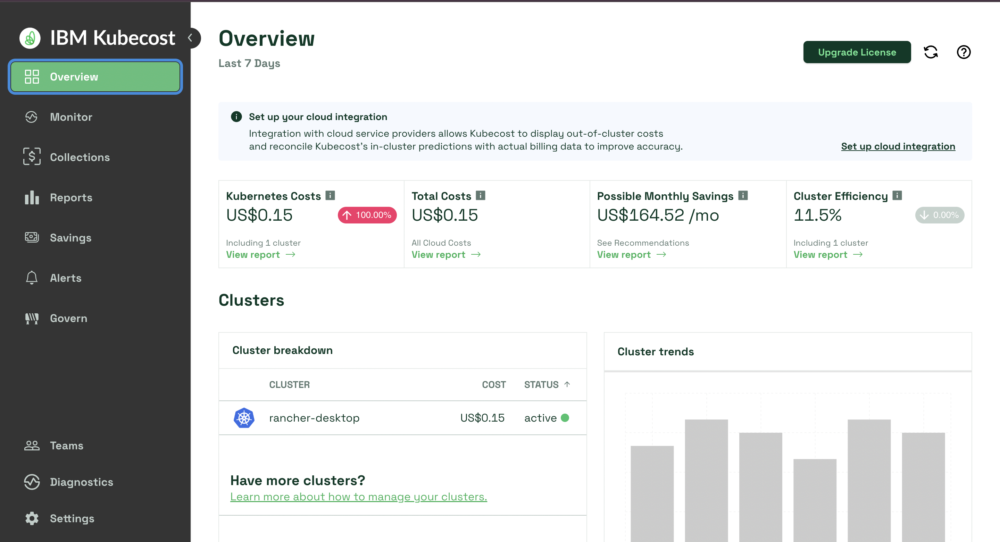

# Cost Monitoring Setup — Kubecost on FinFlow

## Overview
Monitoring cluster costs is as critical as monitoring performance.
Cloud providers like AWS and GCP have native cost dashboards —
Kubecost fills that gap for on-prem and local Kubernetes clusters,
giving visibility into per-namespace and per-pod spend.

## Installation Challenges

### Attempt 1 — Aggregator Disabled
Node memory was at 89% capacity — the Kubecost aggregator pod
failed to schedule due to insufficient memory.

Workaround: installed with aggregator disabled.
Result: Frontend pod entered a crash loop.

**Root cause:**
```
nginx: [emerg] host not found in upstream 
"kubecost-aggregator.monitoring:9004"
```
The frontend's nginx config has a hard dependency on the aggregator
service. Disabling it caused the upstream to become unresolvable,
crashing the frontend on startup.

### Attempt 2 — VM Memory Upgrade
 VM memory upgraded: 4GB → 6GB.
Node utilization dropped from 89% → 55%.
Full installation completed successfully.

## Key Insight — Cluster Efficiency

Kubecost reported **7.5% cluster efficiency**.

Efficiency = actual usage vs allocated resources.

At 7.5%, the cluster is reserving far more than it consumes —
a direct signal of over-provisioning. In a production environment,
this translates to unnecessary infrastructure spend and is an
immediate flag for engineering leadership.

## Abandoned Workloads Finding

Kubecost identified duplicate workloads running across both
`default` and `staging` namespaces — same pods, double the cost,
zero additional value.

**Fix:** Enforce namespace lifecycle policies. Unused namespaces
should be time-bound and cleaned up on a defined schedule.

## Cluster State Post-Setup
- Kubecost: `monitoring` namespace, fully operational
- VM Memory: 6GB (upgraded from 4GB)
- Cluster Efficiency: 7.5% (expected for lab environment)
- Identified savings: ~$164/mo (projected at production pricing)

